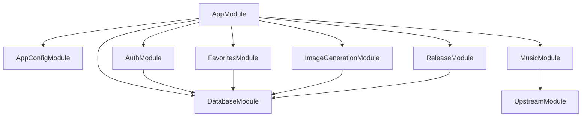
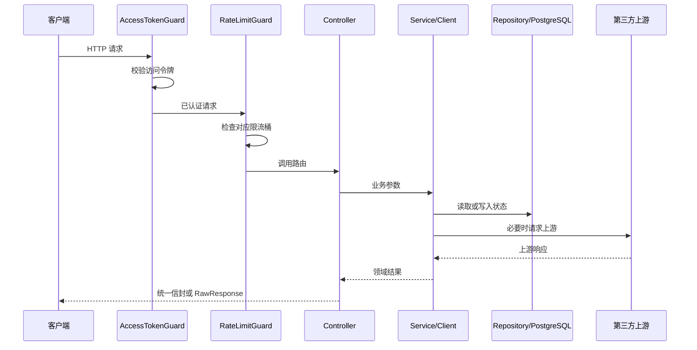

# 后端架构

[返回文档中心](README.md)

## 1. 服务边界

桃桃音乐后端是 NestJS + TypeScript 接口适配服务，负责业务鉴权、上游协议收敛、少量状态持久化和 Android 热更新。

服务负责：

- 用户注册、登录、访问令牌和刷新令牌轮换。
- 收藏数据持久化。
- 腾讯音乐搜索、歌曲信息、播放链接和歌词适配。
- APK 登记、灰度、下载、最低版本和远程配置。
- ApiSweet `gpt-image-2` 任务创建、Key 配额与状态轮询。

服务不负责：

- 长期保存音频、歌词、封面或生成图片文件。
- 把第三方 API Key 下发给客户端。
- 在数据库中保存访问令牌明文或刷新令牌明文。
- 在服务端长期缓存上游限时播放链接。

## 2. 模块依赖



`AppConfigModule` 和 `DatabaseModule` 是全局模块。业务模块可以直接注入 `AppConfigService` 和 `DatabaseService`，不需要重复导入。

## 3. 源码职责

```text
src/
├─ main.ts
├─ app.module.ts
├─ auth/
├─ common/
│  ├─ decorators/
│  ├─ filters/
│  ├─ guards/
│  ├─ interceptors/
│  └─ rate-limit/
├─ config/
├─ database/
├─ favorites/
├─ health/
├─ image-generation/
├─ music/
├─ release/
└─ upstream/
```

### `main.ts`

- 关闭 NestJS 默认 body parser。
- 对 APK 原始字节上传路由跳过 JSON 解析。
- 对其它路由挂载 16KB JSON parser。
- 注册全局 `ValidationPipe`。
- 设置 `/api/v1` 前缀，并排除 `/health`。

修改 body parser 时必须保留 APK 上传例外，否则大文件会被缓存在内存中或直接返回 413。

### `app.module.ts`

- 聚合业务模块。
- 注册访问令牌守卫和限流守卫。
- 注册安全响应头、最新版本号和成功信封拦截器。
- 注册统一异常过滤器。

全局 Provider 的注册顺序会影响请求行为，调整前必须执行完整契约验证。

### `common/`

这里放跨业务基础设施，不放具体业务规则：

- `ApiException` 和稳定业务码。
- `@Public()`、`@RawResponse()`、`@RateLimit()`、`@CurrentUser()`。
- 全局访问控制、限流、响应信封和错误过滤。
- 并发信号量等通用工具。

### `upstream/`

第三方接口的不一致统一在这里收敛。腾讯音乐的成功码、字段名、音质阶梯和歌词格式不能散落到 Controller。

### `image-generation/`

- `image-generation.controller.ts`：HTTP 参数与路由。
- `image-generation.client.ts`：ApiSweet 请求和响应映射。
- `api-key.repository.ts`：Key 池选择、原子扣额和退款。
- `image-task.repository.ts`：任务、提示词、状态和图片地址持久化。
- `dto/`：创建任务的输入校验。

## 4. 普通请求链路



公开路由也会尝试解析访问令牌，但令牌无效时继续放行。`/app/bootstrap` 利用这个行为：有效令牌按用户灰度，无效令牌退回设备号，绝不能返回 401。

## 5. 依赖注入规则

- Controller 只注入 Service、Client 或 Repository，不读取 `process.env`。
- 环境变量统一由 `AppConfigService` 暴露为类型化字段。
- SQL 只写在 Repository 或数据库迁移中。
- 上游协议解析只写在对应 Client。
- 不在构造函数中执行数据库查询；NestJS 实例化 Provider 时迁移可能尚未完成。

## 6. 状态与并发

### 数据库连接

连接池上限为 10。不能跨上游 HTTP 请求持有 `pool.connect()` 得到的连接，否则慢上游会耗尽连接池。

`DatabaseService` 只暴露：

- `first`：取第一行。
- `all`：取多行。
- `run`：执行写操作并返回影响行数。
- `ping`：健康探测。

### 进程内状态

限流计数器和最新全量版本号缓存位于进程内：

- 重启即清空。
- 多实例不共享。
- 多实例部署时不能把它们当作全局一致状态。

### 需要原子 SQL 的路径

- 刷新令牌消费：单条 `UPDATE ... RETURNING`。
- 图片 Key 配额：锁定候选 Key 后单条 `UPDATE ... RETURNING`。
- 并发注册：依赖数据库唯一约束兜底。
- 发布版本登记：依赖 `ON CONFLICT DO UPDATE`。

这些路径不能拆成“先 SELECT、再 UPDATE”。

## 7. 架构修改检查表

- 新路由是否默认鉴权，公开路由是否显式 `@Public()`？
- 是否误给流式接口套了成功信封？
- 是否把上游 401 直接透传给客户端？
- 是否跨网络请求持有数据库连接？
- 是否复制了已有 Client、Repository 或错误映射逻辑？
- 是否更新对应专题文档？
- 是否完成生产构建和 88 项契约验证？
