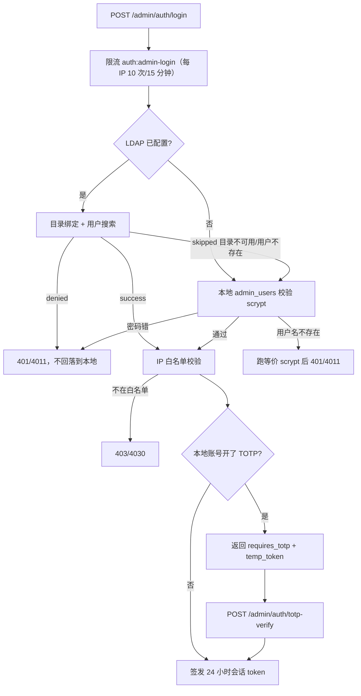

# 管理后台认证

[返回文档中心](README.md)

本文覆盖 `/api/v1/admin/auth/**` 这一组接口：管理员账号、数据库会话、双因素认证、角色权限、
IP 白名单、操作审计和 LDAP/SSO 对接。代码位于 `src/admin-auth/` 和 `src/ldap/`。

普通用户的注册登录见 [03-api-contracts.md](03-api-contracts.md) 的“认证接口”一节；本文只讲**管理端**。

## 1. 和旧管理令牌的关系

后台历史上只有一把静态令牌 `ADMIN_TOKEN`，客户端通过 `X-Admin-Token` 携带。现在有两套并存的凭据：

| 凭据 | 头部 | 用途 | 是否可写外键 |
| --- | --- | --- | --- |
| 管理员会话 | `Authorization: Bearer <token>` | 管理后台登录后签发，可审计到具体人 | 是 |
| 静态管理令牌 | `X-Admin-Token: <ADMIN_TOKEN>` | 存量运维脚本、契约验证脚本 | **否** |

`AdminAuthGuard` 先尝试 Bearer 会话，失败再退回 `X-Admin-Token`。两条路都失败才抛 401/4013。

**这两种凭据对所有管理接口都有效**，包括 `/api/v1/app/admin/**`（发布、补丁、公告、用户、图片 Key）
和 `/api/v1/desktop/admin/**`。它们用的是同一个 `AdminAuthGuard`，所以管理后台登录后直接就能操作
这些页面，不需要另外填 `ADMIN_TOKEN`。

`X-Admin-Token` 兼容路径合成出来的身份是 `id = 0` 的 `legacy_admin`，它在 `admin_users` 表里
**没有对应行**。任何写外键的落库都必须先过 `auditActorId()`，把 `id = 0` 折成 `null`，否则直接撞
外键报 23503。`admin_audit_log.admin_id` 因此是可空列（见 [04-database.md](04-database.md)）。

`ADMIN_TOKEN` 留空时兼容路径整条关闭，但 Bearer 会话不受影响 —— 也就是说，管理后台和上述所有
管理接口都不依赖 `ADMIN_TOKEN` 是否配置。

> **`common/guards/admin-token.guard.ts` 的 `AdminTokenGuard` 是死代码。** 它只认 `X-Admin-Token`
> 且 `ADMIN_TOKEN` 为空时一律拒绝，但全项目没有任何 `@UseGuards` 或模块引用它。历史文档把它写成
> “发布接口的守卫”是过时的；实际生效的一律是 `AdminAuthGuard`。新增管理接口时不要再用它。

前端 `api.ts` 的 `authHeaders()` 用**令牌长度**决定头部：长度大于 60 走 `Authorization: Bearer`，
否则走 `X-Admin-Token`。会话令牌是 48 字节 base64url（约 64 字符），因此走 Bearer；短的手工
`ADMIN_TOKEN` 走兼容头。这个判断很脆（换个长度就会走错分支），但当前两套凭据都能用，所以不会
暴露成故障。

## 2. 登录链路



几个刻意的设计：

- **LDAP `denied` 不回落本地。** 目录明确说“这个人密码错”或“这个人被禁用”时，再去本地
  撞一次密码等于给攻击者多一次机会，也会让被禁用的人靠同名本地账号复活。
- **LDAP `skipped` 才回落。** 目录不可达、没配 LDAP、目录里没这个人，都回落到本地密码。
  这样 LDAP 配错或目录宕机时，本地超管还能进后台救场。
- **用户名不存在也要跑 scrypt。** `verifyAgainstNothing()` 用假盐消耗与“用户存在但密码错”
  等价的计算量，否则响应时间差一个数量级，等于把管理员用户名送出去。
- **LDAP 账号不叠加本地 TOTP。** 目录已经承担了第二因子，再叠一层会让 LDAP 用户登不进来。
- **开了 TOTP 只发挑战票据，不发会话。** 见下一节。

密码错误统一返回 401/4011 且提示都是“用户名或密码错误”，不区分账号是否存在。

## 3. 双因素认证（TOTP）

开启 TOTP 的本地账号走两步：

```text
第一步 POST /admin/auth/login
  → 密码正确且 totp_enabled = 1
  → 响应 { requires_totp: true, temp_token: "...", admin_id: 1 }
  → 不签发会话

第二步 POST /admin/auth/totp-verify
  → 请求体 { temp_token: "...", token: "123456" }
  → 核销票据 → 校验动态码 → 才签发正式会话
```

`temp_token` 是**必需**字段，这是 2FA 能不能成立的关键：

- 没有它，任何知道 `admin_id` 的人都能跳过密码直接进第二步猜 6 位码，2FA 形同虚设。
- 票据 32 字节随机、**5 分钟**过期、**用后即焚**（`consumeTotpChallenge` 无论后续校验成败都
  先删除），所以同一张票无法反复试码。
- 票据存进程内存 `Map`，不落库。重启即失效是期望行为，和限流器一样不跨实例共享。
- 第二步会重新读账号并检查 `disabled_at` / `totp_enabled` / `totp_secret`，禁用或已关 2FA 的
  账号不能靠旧票据拿到会话。
- 请求体里如果带了 `admin_id`，必须与票据绑定的 `admin_id` 一致，防止拿别人的票据试探。

动态码必须是 6 位纯数字（`/^\d{6}$/` 前置拦截），`speakeasy` 校验窗口为 `window: 1`（前后各
一个时间片），TOTP 发行者名称由 `TOTP_ISSUER` 配置，默认“桃桃音乐管理后台”。

管理接口：

| 路径 | 行为 |
| --- | --- |
| `POST /admin/auth/totp-enable` | 校验当前密码后生成密钥，返回 `secret` 和 `otpauth_url`；此时尚未启用 |
| `POST /admin/auth/totp-confirm` | 用一次真实动态码确认，通过后 `totp_enabled = 1` |
| `POST /admin/auth/totp-disable` | 校验当前密码后关闭并清空密钥 |

`totp-enable` 到 `totp-confirm` 之间是“已生成密钥但未启用”的中间态，此时登录仍然不需要动态码。

## 4. 角色与权限

三种角色，定义在 `admin_users.role` 的 CHECK 约束里：

| 角色 | 能读 | 能写 |
| --- | --- | --- |
| `super_admin` | 全部 | 全部，含管理员增删改、IP 白名单 |
| `admin` | 管理员列表、审计日志 | 仅自己的密码和 2FA |
| `viewer` | 无 | 无 |

`RolesGuard` 读 `@RequireRole(...)` 元数据：

- 方法或类上**没有** `@RequireRole` → 放行（只要求已认证）。
- 有标注但不满足 → 403/4030，消息里带上需要的角色名。
- 完全没有身份 → 401/4013。

`RolesGuard` 抛异常而不是返回 `false`。返回 `false` 会被 Nest 变成 403 且不带业务码，客户端
拿不到可判断的错误码；抛 `ApiErrors` 才能落到统一信封里。

非超管调用 `GET /admin/auth/users` 时，`trimAdminRow()` 会裁掉 `ip_whitelist` 和
`last_login_ip` 两列。这不是显示优化，而是防止普通管理员读到别人的网络位置。

写操作有三条自保护规则，都会返回 400/4000：

- 不能降级或禁用当前登录的账号。
- 不能删除自己。
- 不能降级、禁用或删除**最后一个**在用的超级管理员（`assertNotLastSuperAdmin`）。

## 5. IP 白名单与客户端取址

`admin_users.ip_whitelist` 是可空文本列，按换行/逗号分隔存一组 IP。为空表示不限制；非空时
`assertIpAllowed()` 要求当前请求来源命中其中一项，否则 403/4030“当前 IP 不在白名单中”。

登录链路和 2FA 第二步都会校验白名单，所以伪造票据也无法绕过。

**取址是这套机制唯一的软肋。** `X-Forwarded-For` 是客户端可写的请求头，无条件采信它等于
把白名单变成摆设。因此：

```text
TRUST_PROXY 未设置或不是 1/true
  → 用 socket.remoteAddress，忽略 X-Forwarded-For

TRUST_PROXY=1 或 true
  → 取 X-Forwarded-For 的第一个值
```

只有确实部署在可信反向代理之后才设 `TRUST_PROXY=1`，并且代理必须自己覆写而不是追加
`X-Forwarded-For`。直接暴露到公网时保持默认关闭。

当前白名单只做**精确字符串匹配**：不支持 CIDR 网段，也不做 `::ffff:192.168.1.1` 这类
IPv4-mapped 前缀的归一化。写白名单时要填写服务端实际看到的地址格式。

## 6. 操作审计

`admin_audit_log` 记录 `action`、`target_type`、`target_id`、`detail`、`ip_address`、`user_agent`
和 `created_at`。已使用的 action：

| action | 触发点 |
| --- | --- |
| `auth.login` | 本地密码登录成功 |
| `auth.login_ldap` | LDAP 登录成功 |
| `auth.login_totp` | 通过 TOTP 第二步登录成功 |
| `auth.logout` | 退出登录 |
| `auth.password_change` | 修改自己的密码 |
| `auth.totp_enable` / `auth.totp_confirm` / `auth.totp_disable` | 2FA 生命周期 |
| `admin.create` / `admin.update` / `admin.delete` | 管理员增删改 |
| `admin.ip_whitelist_update` | 修改 IP 白名单 |

`GET /admin/auth/audit-log` 支持 `adminId`、`action`、`limit` 查询参数，按时间倒序返回。
`admin_id` 为 `null` 表示这条记录来自 `X-Admin-Token` 兼容身份，或者原管理员已被删除
（外键是 `ON DELETE SET NULL`，历史审计必须保留）。

**审计写入失败不能把主流程带崩。** 登录、改密码这些操作先完成业务动作再写日志；日志表故障时
应该只影响审计完整性，不应该让管理员登不进来。

## 7. 路由表

所有路径都要加 `/api/v1` 前缀。`@AdminGuarded()` = `AdminAuthGuard` + `RolesGuard`。

| 方法 | 路径 | 鉴权 | 最低角色 |
| --- | --- | --- | --- |
| `POST` | `/admin/auth/login` | 公开 | — |
| `POST` | `/admin/auth/totp-verify` | 公开（需 `temp_token`） | — |
| `POST` | `/admin/auth/logout` | 公开（无凭据时静默成功） | — |
| `GET` | `/admin/auth/me` | `@AdminGuarded()` | 任意已认证角色 |
| `POST` | `/admin/auth/change-password` | `@AdminGuarded()` | 任意已认证角色 |
| `POST` | `/admin/auth/totp-enable` | `@AdminGuarded()` | 任意已认证角色 |
| `POST` | `/admin/auth/totp-confirm` | `@AdminGuarded()` | 任意已认证角色 |
| `POST` | `/admin/auth/totp-disable` | `@AdminGuarded()` | 任意已认证角色 |
| `GET` | `/admin/auth/users` | `@AdminGuarded()` | `super_admin` / `admin` |
| `POST` | `/admin/auth/users` | `@AdminGuarded()` | `super_admin` |
| `PATCH` | `/admin/auth/users/:id` | `@AdminGuarded()` | `super_admin` |
| `DELETE` | `/admin/auth/users/:id` | `@AdminGuarded()` | `super_admin` |
| `GET` | `/admin/auth/audit-log` | `@AdminGuarded()` | `super_admin` / `admin` |
| `GET` | `/admin/auth/ip-whitelist/:adminId` | `@AdminGuarded()` | `super_admin` |
| `POST` | `/admin/auth/ip-whitelist/:adminId` | `@AdminGuarded()` | `super_admin` |

`logout` 虽然不带守卫，但会尝试解析 `Authorization: Bearer` 并撤销对应会话；没有凭据时直接
返回 204，不做任何事 —— 这样退出接口本身不会把用户卡在登录页。

限流：`login` 走 `auth:admin-login` 桶，`totp-verify` 走 `auth:admin-totp` 桶，都是**每 IP
10 次/15 分钟**。两个桶分开，避免第一步的尝试次数挤占第二步。

## 8. 数据模型

三张表，详见 [04-database.md](04-database.md) 的同名小节：

- `admin_users`：账号、scrypt 口令、角色、TOTP 密钥、IP 白名单、登录痕迹、禁用时间。
- `admin_sessions`：会话 token 的 SHA-256 哈希、过期时间、撤销时间、登录 IP 和 UA。
- `admin_audit_log`：操作审计，`admin_id` 可空且 `ON DELETE SET NULL`。

会话 token 是 48 字节随机值的 base64url 编码，**只存哈希**，有效期 24 小时。
`validateSession()` 每次都会回表确认管理员未被禁用，所以禁用账号能立刻生效，不用等会话过期。

改密码会撤销该管理员的**其它**会话，保留当前这条：接口返回 204，前端不会跳登录页，把本人
踢下线体验很差；但放着其它设备不管又不安全。

## 9. 启动期三个硬约束

这三条都不是类型错误，`tsc` 和静态审计都发现不了，只有真正把服务跑起来才会暴露。它们曾经
同时存在，导致整个后台无法登录。

### 9.1 不能把 `@UseGuards` 挂在控制器类上

```typescript
// 错误：类级守卫对 login 同样生效
@UseGuards(AdminAuthGuard, RolesGuard)
@Controller("admin/auth")
export class AdminAuthController {}

// 正确：方法级装饰器工厂
const AdminGuarded = () => UseGuards(AdminAuthGuard, RolesGuard);
```

登录时用户手里还没有凭据，类级守卫会让**所有**登录请求先被自己的守卫 401 掉，表现为
`/admin/auth/login` 恒返回 401/4013，谁也进不去。

新增受保护方法时用 `@AdminGuarded()`，不要图省事把它挪到类上。

### 9.2 用到 `AdminAuthGuard` 的模块必须导入 `AdminAuthModule`

Nest 在**声明 Controller 的模块**里解析守卫的依赖。某个模块用了 `AdminAuthGuard` 却没导入
`AdminAuthModule`，启动时会抛：

```text
UnknownDependenciesException: Nest can't resolve dependencies of the AdminAuthGuard (?)
```

这是启动致命错误，进程直接起不来。新增模块引用管理守卫时，记得把 `AdminAuthModule` 加进
`imports`。`ImageGenerationModule` 就踩过这个坑。

### 9.3 默认管理员必须建在 `onApplicationBootstrap`

`DatabaseService` 的迁移跑在 `onModuleInit`，而 `main.ts` 里的代码在两个钩子**之前**执行。
把默认管理员创建写在 `main.ts`，会先撞“关系 admin_users 不存在”。

`AdminBootstrapService` 实现 `OnApplicationBootstrap`，在迁移完成后才创建
`admin / admin123`（`super_admin`）。找不到该用户名才创建，已存在则跳过，所以重启幂等。

首次登录后应立即改密码；默认口令是硬编码的，代码里没有强制首次改密的机制。

## 10. 前端管理后台

Vue 管理后台在 `src/frontend/`，构建产物输出到 `dist/public`，由 Nest 挂在 `/admin/`。

- `AdminLogin.vue`：两步登录。第一步失败清空凭据；第二步 `temp_token` 失效时清空票据并退回
  第一步，而不是停在动态码输入框反复失败。
- `AdminUserManager.vue`、`AuditLogViewer.vue`、`IpWhitelistManager.vue` 都调用
  `/admin/auth/**` 下的路径。改后端路由时必须同步这三处，否则页面表现为 404/4040。

注意 `IpWhitelistManager.vue` 当前没有任何页面引用它，是孤儿组件。

## 11. 验证

管理后台认证的契约断言在 `tools/verify-contract.mjs` 的“管理后台认证：账号 / 角色 / 2FA / 审计”
一节，覆盖：匿名 401/4013、密码错 4011、超管登录、`/me`、管理员列表、审计日志、缺/伪造
`temp_token` 均 4011、`X-Admin-Token` 兼容、伪造 `X-Forwarded-For` 被白名单拒、创建管理员 201、
viewer 读列表 403/4030、viewer 提权 403/4030、`PATCH` 局部更新、兼容身份写审计不报外键、
不能禁用最后一个超管 400/4000、删除管理员 204。

运行方式和数据库准备见 [00-code-index.md](00-code-index.md) 与 [02-development.md](02-development.md)。
契约脚本是有状态的，必须“重置验证库 → 重启服务 → 单次运行”。

## 12. 已知限制

- 默认口令 `admin/admin123` 硬编码，没有强制首次改密。
- `temp_token` 存进程内存，多实例部署时第二步可能落到没有票据的那个实例上。
- IP 白名单只支持精确匹配，不支持 CIDR，也不归一化 IPv4-mapped 地址。
- `admin_users.email` 列在界面上没有编辑入口（后端已支持）。
- `common/guards/admin-token.guard.ts` 的 `AdminTokenGuard` 已无任何引用，是死代码。
- `/app/admin/**` 与 `/desktop/admin/**` 虽然接受会话令牌，但**既不做角色校验、也不写审计**：
  它们只有 `@UseGuards(AdminAuthGuard)`，没有 `RolesGuard` / `@RequireRole`，Controller 里也不调
  `AuditLogRepository`。后果是任何能登录后台的角色（含 `viewer`）都能调发布、补丁、公告、用户管理
  和图片 Key 接口，而且操作记录里查不到是谁做的。`@RequireRole` 目前只出现在
  `admin-auth.controller.ts` 内部。
- 前端 `api.ts` 用令牌长度（> 60）判断走 Bearer 还是 `X-Admin-Token`，是脆弱的隐式约定。
