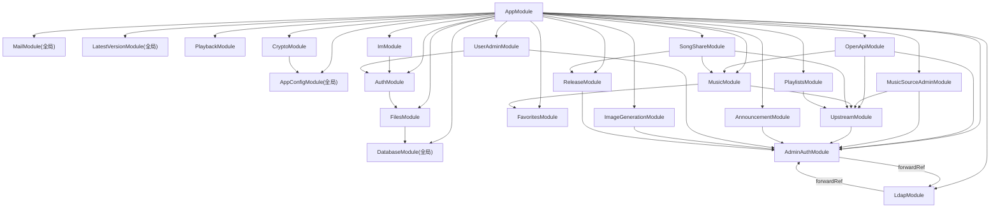

# 模块划分与依赖规则

[返回文档中心](README.md)

最后更新:2026-09-30

本文讲模块怎么分、依赖怎么走、代码该写在哪个文件。路由与表的完整清单见 [00-code-index.md](00-code-index.md)。进程内状态与单实例假设见 §4。

## 1. 模块依赖图

下图只画**显式 `imports`**(与 `app.module.ts` 和各 module 文件逐一对应):



三类模块要特殊记忆:

- **全局模块**:`AppConfigModule`、`DatabaseModule`、`MailModule`、`LatestVersionModule`(后者在 `release/latest-version.cache.ts` 里定义)。业务模块可以直接注入 `AppConfigService`、`DatabaseService`、`MailService`、`LatestVersionCache`,不需要重复导入。
- **互相依赖的一对**:`AdminAuthModule` 与 `LdapModule`(LDAP 登录成功要同步管理员行,认证模块要用 LDAP 校验口令),两边都用 `forwardRef()` 打破循环,且都被 `AppModule` 直接导入。它们**不是全局模块**。
- **守卫提供方**:`AdminAuthModule` 导出 `AdminAuthGuard`、`AdminAuditService`、`AdminUsersRepository`。任何模块用到这三者都必须显式 `imports: [AdminAuthModule]`,否则启动报 `UnknownDependenciesException`(详见 [82-admin-routes-data.md](82-admin-routes-data.md) 的硬约束)。目前 `UpstreamModule`、`AnnouncementModule`、`ReleaseModule`、`ImageGenerationModule`、`UserAdminModule`、`OpenApiModule`、`MusicSourceAdminModule` 都因此导入它 —— `UpstreamModule` 导入的原因是音源账号后台控制器要写审计。

## 2. 源码目录职责

```text
src/
├─ main.ts
├─ app.module.ts
├─ auth/
├─ common/
│  ├─ decorators/
│  ├─ filters/
│  ├─ interceptors/
│  └─ rate-limit/
├─ config/
├─ database/
├─ announcement/
├─ favorites/
├─ files/
├─ playback/
├─ playlists/
├─ health/
├─ crypto/
├─ image-generation/
├─ music/
├─ open-api/
├─ release/
├─ im/
├─ mail/
├─ shares/
├─ user-admin/
├─ admin-auth/
├─ ldap/
├─ frontend/
├─ upstream/
└─ tools/
```

注意:`common/` 下**没有** `guards/` 目录,历史上住在那里的 `AdminTokenGuard` 已删除。管理守卫都在 `admin-auth/`。

### `main.ts`

- 关闭 NestJS 默认 body parser。
- 挂载传输加密中间件(`crypto.middleware.ts`):**必须先于 body parser**,带 `X-Taotao-Crypto` 头的请求按 AAD(method+path+query)逐块 AEAD 解密出原始字节,无加密头的请求完全透明。`RAW_BODY_PATHS` 白名单与 `*/play` 音频流不参与解密;强制加密白名单(`GET /api/v1/favorites`)拒绝明文降级(HTTP 426/4007)。
- 对 APK 和 Android 补丁原始字节上传路由跳过 JSON 解析。
- 普通路由挂载 16KB JSON parser。
- 挂载 `/admin` 静态资源,CSP 中间件**必须位于 `expressStatic` 之前**(否则真正的 JS/CSS 响应拿不到 CSP)。
- 挂载 `/share` 静态资源(版本化路径 + 改写 `<base>`,见 [12-request-pipeline.md](12-request-pipeline.md))。
- 注册全局 `ValidationPipe`,关闭 `x-powered-by`。
- 设置 `/api/v1` 前缀,并排除 `/health`。

修改 body parser 时必须保留 APK 上传例外,否则大文件会被缓存在内存中或直接返回 413;调整中间件挂载顺序时,加密解密必须保持在 body parser 之前。

### `app.module.ts`

- 聚合业务模块。
- 注册访问令牌守卫和限流守卫。
- 注册安全响应头、最新版本号和成功信封拦截器。
- 注册统一异常过滤器。

全局 Provider 的注册顺序会影响请求行为,调整前必须执行完整契约验证(见 [22-contract-verification.md](22-contract-verification.md))。

### `common/`

放跨业务基础设施,不放具体业务规则:

- `ApiException` 和稳定业务码。
- `@Public()`、`@RawResponse()`、`@RateLimit()`、`@CurrentUser()`。
- 全局访问控制、限流、响应信封和错误过滤。
- 并发信号量等通用工具。

### `upstream/`

第三方接口的不一致统一在这里收敛。各音源(腾讯/网易/酷我/波点)的成功码、字段名、音质阶梯和歌词格式不能散落到 Controller:

- `music-source.registry.ts` 按注册表分派。
- `music-source-account.repository.ts` 管理音源账号凭据(token 只写不读)。
- `music-source-admin.controller.ts` 提供后台管理接口。
- `kuwo.client.ts`、`bodian.client.ts`、`kpk.util.ts` 等各自封装对应协议;KPK 原生签名自检用 `npm run verify:kpk`,波点逐字歌词解析自检用 `npm run verify:lrcx`(见 [53-feature-music-sources.md](53-feature-music-sources.md))。

### `crypto/`

传输层加密:

- `crypto.controller.ts` 暴露公开握手 `POST /crypto/handshake`,以及受访问令牌保护的 `GET /crypto/psk`(把 PSK 下发给已登录客户端,密钥不再内嵌于 App)。
- `crypto.middleware.ts` 在 body parser 之前做 AEAD 解密。
- `crypto-transport.service.ts` 在 `onApplicationBootstrap` 加载 `crypto/dist` 的原生产物(协议版本须 ≥2)、登记 PSK 并启动每分钟的过期会话清理。`CRYPTO_PSK_HEX` 未配置时随机生成一把(重启即变,打 WARN),配置后用固定值;无论哪种,都经 `GET /crypto/psk` 下发,两端天然一致。
- `native-loader.ts` 负责跨平台产物查找,缺失或协议版本过低时只 WARN 并降级为明文链路(这是唯一会触发「未启用加密」503/5031 的情况)。

协议细节见 [37-api-crypto.md](37-api-crypto.md)。

### `image-generation/`

- `image-generation.controller.ts`:HTTP 参数与路由。
- `image-generation.client.ts`:ApiSweet 请求和响应映射。
- `api-key.repository.ts`:Key 池选择、原子扣额和退款。
- `image-task.repository.ts`:任务、提示词、状态和图片地址持久化。
- `dto/`:创建任务的输入校验。

完整专题见 [50-feature-image-generation.md](50-feature-image-generation.md)。

### 其它业务模块的边界

- `auth/` 只负责身份和资料;邮箱发信由 `mail/` 承担,头像二进制经 `files/` 的 `AvatarStoreService` 存入 `user_avatars` 表,不能把 SMTP 或头像存取散到页面 Controller。
- `favorites/` 保存收藏状态机;搜索只通过 Repository 批量查询,不为每首歌单独请求收藏接口。
- `playback/` 把会话快照、最近播放可见代际和累计统计分开,清空操作不删除统计。
- `playlists/` 的所有顺序/完整替换操作在事务内锁定歌单,`source + songId` 是歌曲身份,展示字段只是快照。
- `release/` 拥有 Android APK 的版本、文件和最低版本语义,使用 APK 文件名逻辑管理产物。
- `im/` 只代理悟空 IM 的凭据和同步命令;聊天正文、频道游标不进入 PostgreSQL。
- `files/` 承担头像存取与匿名只读下载端点(`AvatarStoreService`、`user_avatars` 表)。
- `admin-auth/` 拥有管理后台的身份与权限:账号、会话、2FA、角色守卫、IP 白名单和审计。它对外只暴露 `AdminAuthGuard` 与角色常量(`admin-roles.ts`),并提供 `AdminAuditService` 给业务控制器写审计,其它模块不应自己实现管理员鉴权。
- `ldap/` 只做目录协议(Bind、Search、过滤器编解码)和角色映射,不直接签发会话;`authenticate()` 返回 `success`/`denied`/`skipped` 三态,由 `admin-auth/` 决定是否回落本地口令。
- 下面 7 个控制器都挂 `@AdminGuarded()`(= `AdminAuthGuard` + `RolesGuard`,只认管理员会话 `Authorization: Bearer`),不要误加普通访问令牌依赖:
  `admin-auth/admin-auth.controller.ts`(公开的 `login` / `totp-verify` / `logout` 三个方法除外)、
  `announcement.controller.ts`(只保护 `/app/admin/*` 那几个方法,公开的 `GET /announcements` 不能加)、
  `release/release-admin.controller.ts`、
  `user-admin/user-admin.controller.ts`、`image-generation/image-key-admin.controller.ts`、
  `open-api/open-api-key-admin.controller.ts`、`upstream/music-source-admin.controller.ts`。
  **一律逐方法挂,没有例外**:类级 `@UseGuards` 会在将来新增公开路由时静默拦下它,
  且漏标一个方法就等于那条路由裸奔。见 `admin-auth/admin-guarded.decorator.ts`。
  写操作标 `@RequireRole(...WRITE_ROLES)` 并调 `AdminAuditService` 留痕;读操作标 `@RequireRole(...READ_ROLES)`,
  **但返回个人数据的读接口要用 `PRIVILEGED_READ_ROLES`** —— 目前是 `user-admin` 的两个读接口
  (`email` 与逐首歌的听歌历史)、音源账号清单(凭据属个人信息)以及管理域的
  `GET /admin/auth/users` 与 `GET /admin/auth/audit-log`,观察者看不到。改这类接口要同时改 `App.vue` 的页签可见性(见 [83-admin-frontend.md](83-admin-frontend.md))。

## 3. 依赖注入规则

- Controller 只注入 Service、Client 或 Repository,不读取 `process.env`。
- 环境变量统一由 `AppConfigService` 暴露为类型化字段(变量清单见 [21-configuration.md](21-configuration.md))。
- SQL 只写在 Repository 或数据库迁移中。
- 上游协议解析只写在对应 Client。
- 不在构造函数中执行数据库查询;NestJS 实例化 Provider 时迁移可能尚未完成(时序见 [13-startup-lifecycle.md](13-startup-lifecycle.md))。
- 守卫的依赖在**声明 Controller 的模块**里解析,不是提供守卫的模块。引用 `AdminAuthGuard` 或 `RolesGuard` 的模块必须自己 `imports: [AdminAuthModule]`,否则启动报 `UnknownDependenciesException`。
- `@UseGuards` 挂在类上会作用于该 Controller 的**所有**方法。同一个控制器里既有公开方法又有受保护方法时(例如 `admin/auth` 的 `login` 和 `me`),必须用方法级装饰器,不能图省事提到类上。

## 4. 进程内状态与单实例假设

有一组关键状态**只活在进程内存里**,不落库、不跨实例共享、进程重启即清空。这是当前架构的一条硬前提:后端按**单实例**部署(单个 ghcr 容器),尚未为水平扩容做共享存储抽象。

| 状态 | 位置 | 重启/多实例后果 |
| --- | --- | --- |
| 限流计数桶 | `common/rate-limit/rate-limit.service.ts` 的滑动窗口 `Map` | 重启后所有桶清零;多实例各算各的,实际阈值 ×实例数 |
| 管理员登录退避 | `admin-auth/admin-auth.service.ts` 按账号计数的 `Map` | 重启后退避解除;多实例下暴力破解可绕开退避 |
| 2FA 挑战票据 | `admin-auth/admin-auth.service.ts` 内存 `Map`(5 分钟一次性) | 第一步登录与第二步 `totp-verify` 若落到不同实例,票据校验必失败 |
| 最新版本号缓存 | `release/latest-version.cache.ts` | 重启后首个 `/app/bootstrap` 回源填充,期间提示头可能缺失 |

**含义**:

- 在此之前**不要**假设「限流一定拦得住」或「退避一定生效」——单实例下成立,一旦扩容就破。
- 引入第二个实例前必须先把上面四项迁到共享存储(Redis 之类),这是扩容的**前置条件**,不是可选优化。加密会话本身(`crypto-transport.service.ts` 的会话表)也是进程内,同理。
- 会话令牌、刷新令牌、审计、账号口令这些**已落 PostgreSQL** 的状态不在此列,可安全跨实例。

代码里相关位置都有注释标注这一前提;改这些服务时不要顺手把某项「优化」成看似无害的内存缓存而不评估扩容影响。部署形态见 [60-deploy-backend.md](60-deploy-backend.md)。
