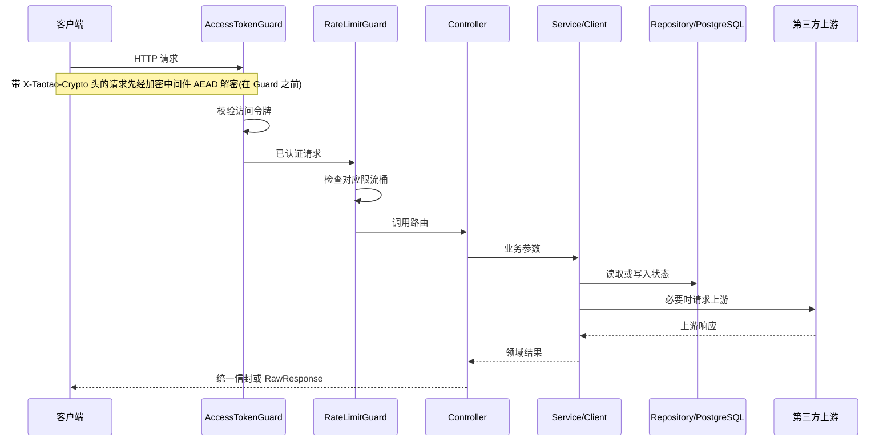

# 请求链路与全局设施

[返回文档中心](README.md)

最后更新:2026-09-30

本文讲一个请求从进入到返回经过的所有环节:中间件 → 守卫 → 限流 → 控制器 → 服务 → 拦截器/过滤器。改全局行为、排查「请求被谁拦了」都从这里入手。

## 1. 普通请求链路



公开路由也会尝试解析访问令牌,但令牌无效时继续放行。`/app/bootstrap` 利用这个行为:有效令牌按用户灰度,无效令牌退回设备号,绝不能返回 401。

### 传输加密中间件(在所有 Guard 之前)

`main.ts` 挂载的 `crypto.middleware.ts` 是整个链路的**第一环**,必须在 body parser 之前拿到原始字节:

- 带 `X-Taotao-Crypto` 头且路径未排除:按 AAD(method+path+query)逐块 AEAD 解密,把明文重建进请求流,再包装响应侧把下行明文 `seal()` 成密文帧。
- 无加密头的请求完全透明;但命中**强制加密白名单**且链路已启用时直接拒绝(HTTP 426/4007「此接口要求加密访问,请升级客户端」)。当前白名单只有 `GET /api/v1/favorites`。
- 排除路径(按明文放行):`/api/v1` 之外的静态路径、`POST /api/v1/app/admin/releases` 与 `POST /api/v1/app/admin/patches`(原始上传)、`*/play` 音频流。
- 加密头格式错误 400/4006,会话不存在或已过期 409/4091(客户端需重新握手)。
- `CRYPTO_REQUEST_LOG`(默认开,设 `off` 关闭)为每个 `/api/v1` 请求打一行「明文/加密」可观测日志。

## 2. 全局 Provider 清单

全局 `APP_GUARD` 只有两个:`AccessTokenGuard` 和 `RateLimitGuard`。拦截器与过滤器如下:

| Provider | 当前行为 |
| --- | --- |
| `AccessTokenGuard` | 默认保护所有路由;`@Public()` 只允许「无令牌/无效令牌继续」,不绕过有效令牌解析;受保护路由失败固定为 401/4010 |
| `RateLimitGuard` | 读取 `@RateLimit()`,在 Controller 前执行用途限流;未登录的受保护限流路由返回 401 |
| `EnvelopeInterceptor` | 普通返回包装为 `{code:0,message:"success",data}`;`@RawResponse()` 和 `undefined` 不包装 |
| `LatestVersionHeaderInterceptor` | 依据已全量发布版本写 `X-Latest-Version-Code`/`X-Latest-Patch-Version`;进程内同步缓存,冷启动异步填充 |
| `SecurityHeadersInterceptor` | CORS 白名单回显 + `Vary: Origin`(白名单留空时不下发任何 CORS 头;音视频流与搜索在各自路由里另行设置 `*`)、`nosniff`、`DENY`、`no-referrer` 和默认 `no-store` |
| `AllExceptionsFilter` | 将异常统一成业务信封;未知异常为 HTTP 502/5020;已发送响应的流只结束连接 |

`AdminAuthGuard` 和 `RolesGuard` **不是全局守卫**,由 `AdminAuthModule` 提供,逐方法挂在管理路由上(见 [82-admin-routes-data.md](82-admin-routes-data.md))。`ApiKeyGuard` 也不是全局守卫,只挂在 `/open/**` 路由上(见 [36-api-open.md](36-api-open.md))。

全局 Provider 的注册顺序会影响请求行为,调整前必须跑完整契约验证(见 [22-contract-verification.md](22-contract-verification.md))。

## 3. 请求体解析的例外路径

普通 JSON 请求体上限 16KB。

原始请求体(跳过 JSON 解析)的路径:

```text
POST /api/v1/app/admin/releases
POST /api/v1/app/admin/patches
```

## 4. 静态资源

- **管理后台**:`/admin/`,构建目录 `dist/public`。漏跑 `npm run build:frontend` 会直接 404。CSP 由挂在 `expressStatic` **之前**的 `/admin` 中间件下发(`script-src 'self'`,无内联脚本;策略细节见 [83-admin-frontend.md](83-admin-frontend.md))。
- **分享播放器**:`/share/*` 资源和 `/s/{token}` 页面,构建目录 `dist/share-player`。
  入口 JS 与应用 wasm 都是**固定名**,两者必须严格同批(JS 胶水要提供 wasm 的全部 `js_code` 导入),否则浏览器抛 `LinkError ... requires a callable`。所以服务端把它们挂成**版本化路径** `/share/v/<内容指纹>/…`,并改写 `index.html` 的 `<base>` 指向它,让所有相对引用自动跟版本走(实现见 `src/common/share-player-assets.ts`)。未版本化的 `/share/*` 保留,用于兼容历史页面与绝对路径引用。
- 资源不存在时后端仍可启动,只记录警告。

## 5. 响应阶段顺序

普通 Controller 返回领域对象后:

1. `EnvelopeInterceptor` 包装 `{code,message,data}`。
2. `LatestVersionHeaderInterceptor` 写入全量版本响应头。
3. `SecurityHeadersInterceptor` 写入安全响应头。
4. Express 序列化并发送响应。

抛出异常时由 `AllExceptionsFilter` 接管。流式接口一旦已经发送响应头,就不能再改状态码或追加 JSON 错误体,只能结束连接。因此搜索会在 `writeHead` 前完成收藏批量查询等可能失败的操作。

新增拦截器或自行 `writeHead` 时,要确认不会覆盖已经由全局拦截器设置的响应头(响应头清单见 [30-api-conventions.md](30-api-conventions.md))。
