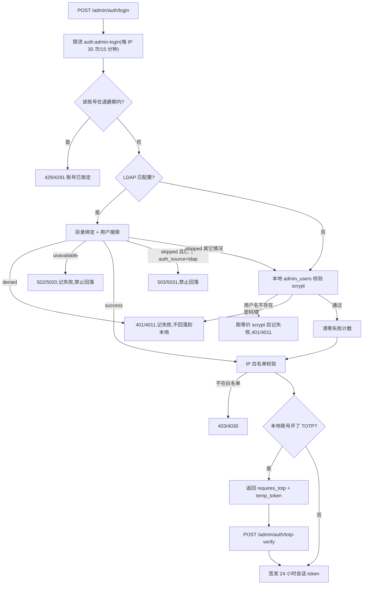

# 管理后台:会话、登录与 2FA

[返回文档中心](README.md)

最后更新:2026-09-30

本文覆盖 `/api/v1/admin/auth/**` 的登录链路:管理员会话、账号退避、TOTP 双因素和 LDAP/SSO 对接。代码位于 `src/admin-auth/` 和 `src/ldap/`。角色与审计见 [81-admin-roles-audit.md](81-admin-roles-audit.md),路由表与硬约束见 [82-admin-routes-data.md](82-admin-routes-data.md),前端见 [83-admin-frontend.md](83-admin-frontend.md)。普通用户的注册登录见 [31-api-auth-user.md](31-api-auth-user.md)。

## 1. 唯一的凭据:管理员会话

后台只有一种管理凭据:

| 凭据 | 头部 | 用途 | 是否可写外键 |
| --- | --- | --- | --- |
| 管理员会话 | `Authorization: Bearer <token>` | 登录后签发,可审计到具体人、可撤销、可 2FA | 是 |

**`X-Admin-Token` 静态兼容通道已整体移除**:`ADMIN_TOKEN` 环境变量、`AppConfigService.adminToken` 字段、`AdminAuthGuard` 里的兼容分支、前端 `api.ts` 里按令牌长度选头部的逻辑,全部不再存在。

移除的理由是它同时绕过了四道控制,而且合成的是固定的 `super_admin` 身份:

- **绕过 2FA** —— 静态令牌直接换到全权限,TOTP 形同虚设。
- **绕过 IP 白名单** —— 白名单只在会话路径上校验。
- **绕过会话撤销** —— 改密码、禁用账号都撤不掉这把钥匙,只能改环境变量并重启。
- **绕过审计归属** —— 它合成的身份 `id = 0` 在 `admin_users` 里没有对应行,所有操作都记成「无归属」,出了事查不到人。

现在所有管理接口(`/api/v1/admin/auth/**`、`/api/v1/app/admin/**`)都只认登录后签发的会话令牌,用的是同一个 `AdminAuthGuard`。

> **`AdminTokenGuard` 早已删除。** `common/guards/admin-token.guard.ts` 曾经只认 `X-Admin-Token` 且在 `ADMIN_TOKEN` 为空时一律拒绝,但全项目没有任何 `@UseGuards` 或模块引用它,是纯死代码。历史文档把它写成「发布接口的守卫」是错的;实际生效的一律是 `AdminAuthGuard`。要判断某个守卫是否生效,`grep` 它在 `@UseGuards` 里的实际引用,不要靠文件名或旧文档推断。

### 数据库里为什么还允许 `admin_id` 为空

`admin_audit_log.admin_id` 仍是可空列、仍是 `ON DELETE SET NULL`:管理员被删除后,他的历史审计记录必须保留为「无归属」,而不是被连带删掉。`auditActorId()` 仍保留,作用从「把兼容身份的 `id = 0` 折成 `null`」变成**防御性收敛** —— 身份缺失或 `id` 不是正整数时一律写 `null`,不让非法值撞外键。

## 2. 登录链路



几个刻意的设计:

- **LDAP `denied` 不回落本地。** 目录明确说「这个人密码错」或「这个人被禁用」时,再去本地撞一次密码等于给攻击者多一次机会,也会让被禁用的人靠同名本地账号复活。
- **LDAP `unavailable` 一律拒绝,不回落。** 这个状态表示**目录已经用用户 DN 绑定成功**,只是之后的取组/角色映射/同步失败 —— 身份其实已经确认过了。此时回落到本地口令,正好给「目录里已停用、但本地还留着旧哈希」的账号开了一条后门。
- **`skipped` 只在账号未被目录接管时才回落。** 目录不可达、没配 LDAP、目录里没这个人,都回落到本地密码,这样 LDAP 配错或目录宕机时本地超管还能进后台救场。但账号的 `auth_source = 'ldap'` 时不允许回落,否则「目录判定已停用」在目录抖动时失效。
- **用户名不存在也要跑 scrypt。** `verifyAgainstNothing()` 用假盐消耗与「用户存在但密码错」等价的计算量,否则响应时间差一个数量级,等于把管理员用户名送出去。
- **LDAP 账号不叠加本地 TOTP。** 目录已经承担了第二因子,再叠一层会让 LDAP 用户登不进来。
- **开了 TOTP 只发挑战票据,不发会话。** 见 §3。
- **账号维度退避先于一切。** 见下面的「登录失败退避」。

密码错误统一返回 401/4011 且提示都是「用户名或密码错误」,不区分账号是否存在。

## 3. 登录失败退避

`auth:admin-login` 的 IP 限流挡不住代理池 —— 换一个出口地址就能对已知的 `admin` 账号继续猜。所以再加一层**以账号为键**的退避,实现在 `AdminAuthService`(不是 `RateLimitService`,因为它只在 `AppModule` 的 providers 里且未导出,控制器注入不到):

| 项 | 值 |
| --- | --- |
| 触发阈值 | 连续失败 5 次 |
| 第 1 轮退避 | 5 分钟 |
| 升级方式 | 每多一轮翻倍:5 → 10 → 20 → 30 分钟封顶 |
| 错误码 | **429/4291**(`ApiErrors.accountLocked()`) |
| 计数清零 | 登录成功时整条清除 |

两条容易写错的细节:

- **`failures` 与 `lockouts` 必须分开记。** 退避期一过只清 `failures`(让正常管理员重新拿到完整额度),保留 `lockouts`(让反复失败的账号下一轮锁更久)。如果退避期一到就把整条记录删掉,指数升级永远停在第一档;如果只清 `lockedUntil` 不清 `failures`,被锁过一次之后打错一个字就再挨 5 分钟,对正常人也过于苛刻。
- **`lockedUntil` 为 0 表示「还没到阈值」,此时绝不能删条目。** 早期实现把「不在退避期」等同于「清理历史计数」,结果是每次登录都清零,阈值永远达不到 —— 退避看起来实现了,实际完全没生效。

**4291 与 4290 必须分开。** 4290 是来源地址限流(换 IP 或等窗口过去就恢复),4291 是账号被锁(换 IP 无用,必须等退避走完)。共用一个码的话,运维和客户端都分不清该换网络还是该等锁,契约脚本也写不出有意义的断言 —— 它会在账号退避完全没生效时因为 IP 限流先命中而变绿。

## 4. 双因素认证(TOTP)

开启 TOTP 的本地账号走两步:

```text
第一步 POST /admin/auth/login
  → 密码正确且 totp_enabled = 1
  → 响应 { requires_totp: true, temp_token: "...", admin_id: 1 }
  → 不签发会话

第二步 POST /admin/auth/totp-verify
  → 请求体 { temp_token: "...", token: "123456" }
  → 核销票据 → 校验动态码 → 才签发正式会话
```

`temp_token` 是**必需**字段,这是 2FA 能不能成立的关键:

- 没有它,任何知道 `admin_id` 的人都能跳过密码直接进第二步猜 6 位码,2FA 形同虚设。
- 票据 32 字节随机、**5 分钟**过期、**用后即焚**(`consumeTotpChallenge` 无论后续校验成败都先删除),所以同一张票无法反复试码。
- 票据存进程内存 `Map`,不落库。重启即失效是期望行为,和限流器一样不跨实例共享。
- 第二步会重新读账号并检查 `disabled_at` / `totp_enabled` / `totp_secret`,禁用或已关 2FA 的账号不能靠旧票据拿到会话。
- 请求体里如果带了 `admin_id`,必须与票据绑定的 `admin_id` 一致,防止拿别人的票据试探。

动态码必须是 6 位纯数字(`/^\d{6}$/` 前置拦截),校验窗口为 `window: 1`(前后各一个时间片),TOTP 发行者名称由 `TOTP_ISSUER` 配置,默认「桃桃音乐管理后台」。

> **TOTP 算法是自实现的,不再依赖 `speakeasy`。** 实现位于 `src/admin-auth/totp.ts`(`base32Encode` / `base32Decode` / `hotp` / `totp` / `verifyTotpCode` / `generateTotpSecret`),移除依赖是因为 `speakeasy@^2` 已停止维护,而它正好是校验第二因子的那段代码。库里已存的 base32 密钥无需迁移:解码逻辑与 RFC 4648 一致,`otpauth://` URL 的格式也保持不变。用 `npm run verify:totp` 校验(RFC 4226 附录 D + RFC 6238 附录 B 向量、窗口边界,36 项)。

管理接口:

| 路径 | 行为 |
| --- | --- |
| `POST /admin/auth/totp-enable` | 校验当前密码后生成密钥,返回 `secret` 和 `otpauth_url`;此时尚未启用 |
| `POST /admin/auth/totp-confirm` | 用一次真实动态码确认,通过后 `totp_enabled = 1` |
| `POST /admin/auth/totp-disable` | 校验当前密码后关闭并清空密钥 |

`totp-enable` 到 `totp-confirm` 之间是「已生成密钥但未启用」的中间态,此时登录仍然不需要动态码。

## 5. 数据模型与会话

三张表(`admin_users`、`admin_sessions`、`admin_audit_log`)的字段定义见 [43-database-tables-admin.md](43-database-tables-admin.md)。要点:

- 会话 token 是 48 字节随机值的 base64url 编码,**只存哈希**,有效期 24 小时。
- `validateSession()` 每次都会回表确认管理员未被禁用,所以禁用账号能立刻生效,不用等会话过期。
- 改密码会撤销该管理员的**其它**会话,保留当前这条:接口返回 204,前端不会跳登录页,把本人踢下线体验很差;但放着其它设备不管又不安全。
- `auth_source` 有两个作用:一是登录时判断「这个账号是否已被目录接管」(决定目录不可用时能不能回落本地口令),二是把 LDAP 同步进来的账号与本地账号区分开。`LdapService.syncToLocal()` 在首次同步时写入 `'ldap'`,存量账号在下一次登录时补齐标记。

## 6. 默认管理员的引导

`AdminBootstrapService` 在 `onApplicationBootstrap` 创建 `admin`(`super_admin`),初始口令二选一:

| `ADMIN_INITIAL_PASSWORD` | 初始口令 | 日志行为 |
| --- | --- | --- |
| 已设置(至少 12 字符,否则启动失败) | 取该值 | `LOG` 只写「口令取自环境变量」,**不打印明文** |
| 未设置 | `randomBytes(32).toString("base64url")` | `WARN` 打印一次明文,并提示设置环境变量 |

无论哪种来源,创建的账号都带 `must_change_password = 1`;改密前除 `me` 与 `change-password` 外一律 403/4031。拦截与放行的实现约束见 [82-admin-routes-data.md](82-admin-routes-data.md) 的硬约束一节;首次上线的操作清单见 [60-deploy-backend.md](60-deploy-backend.md)。
